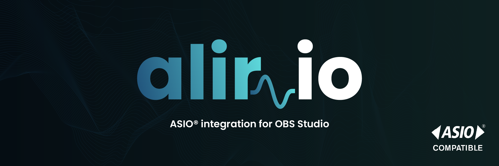
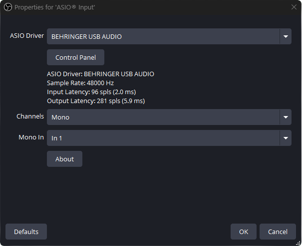
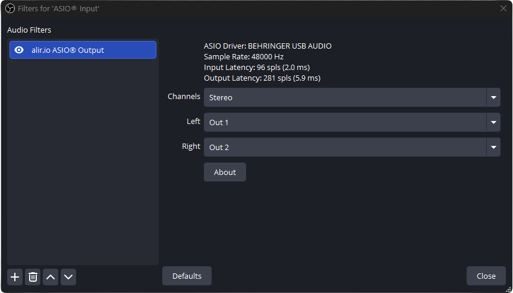

<div align="center">
  
</div>

---

<div align="center">

[](https://github.com/aprixlabs/alir-io/blob/main/LICENSE)
[](https://github.com/aprixlabs/alir-io/releases)
[](https://github.com/aprixlabs/alir-io/releases)

</div>

**alir.io** is a lightweight plugin designed to natively integrate ASIO hardware into OBS Studio for clean, multi-channel audio capture and low-latency direct monitoring.

## Features
* **ASIO Input Source:** Capture direct audio from your ASIO interface into OBS.
  
  
  
* **ASIO Output Filter:** Dedicated direct monitoring. Route your ASIO input sources straight back to your ASIO hardware with low latency.
  
  
  
* **Multi-channel Support:** Works with Mono, Stereo, and complex surround setups (up to 7.1).

## Installation
**Windows :**
* **Installer (Recommended):** Just grab the latest `.exe` installer from the **[Releases](../../releases/latest)** page. Run it, restart OBS Studio, and you're done.
* **Manual (.zip):** Download the `*-Portable.zip` version, extract it, and drop the `data` and `obs-plugins` folders directly into your OBS Studio installation directory (usually `C:\Program Files\obs-studio`). Restart OBS.

Once installed, you'll find the new ASIO options waiting for you in your Sources and Audio Filters menus.

## Requirements

[OBS v31.1.1 or higher](https://github.com/obsproject/obs-studio/releases) (Windows x64)

## Development

Building the project is fully automated using **CMake Presets**. Dependencies (Qt6, OBS Studio SDK, ASIO SDK) are fetched automatically.

**Prerequisites :**
- Visual Studio 2022 (with *Desktop development with C++* workload)
- CMake 3.28+
- [Inno Setup 6](https://jrsoftware.org/isinfo.php) (Only required for building the `.exe` installer)

**Build Instructions (Windows x64):**
```powershell
# 1. Configure the project and download all dependencies
cmake --preset windows-x64

# 2. Compile the plugin
cmake --build --preset windows-x64

# 3. Create local installation (output goes to /release folder)
cmake --install build_x64 --prefix release --config RelWithDebInfo

# 4. Generate the installer (.exe)
cmake --build --preset windows-x64 --target package
```

## Acknowledgments
A special thanks to the [obs-asio](https://github.com/Andersama/obs-asio) project by Andersama. Their foundational work in bringing ASIO support to OBS Studio served as a major inspiration for the development of alir.io.

## License & Trademarks
This project is licensed under the [GPL-3.0 License](LICENSE).

*ASIO is a registered trademark of Steinberg Media Technologies GmbH.*

For more information regarding the ASIO SDK, please visit the [Steinberg Developer Portal](https://www.steinberg.net/developers/asiosdk-open/).

## Support alir.io
Keep my throat from getting scratchy:D

[](https://ko-fi.com/aprixlabs)
